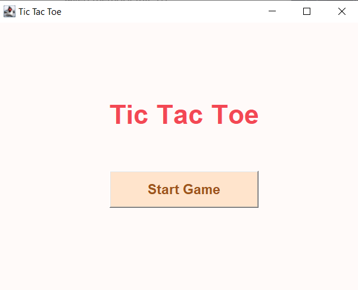
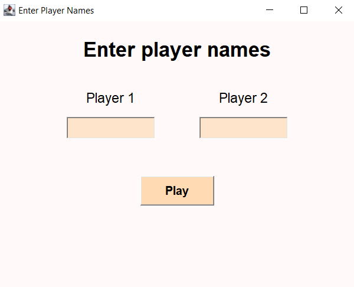
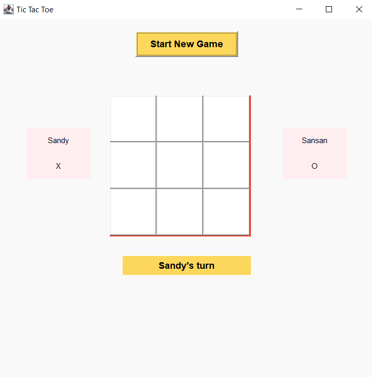
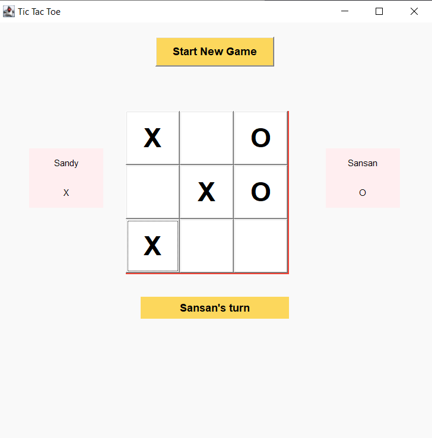
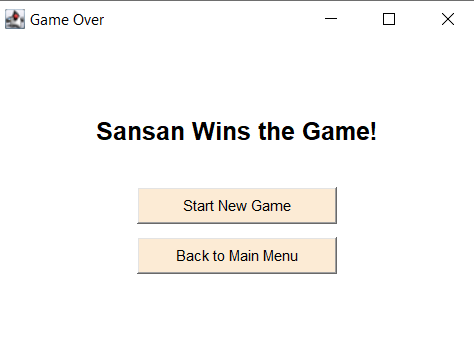

# Tic Tac Toe Game

This is a simple Tic Tac Toe game that allows players to take turns with each other until it arrives at a winning point.

## Features

- Allows up to two nameable players.
- Includes a 3x3 grid as playing field.
- It keeps track of whose player's turn is it in the game.
- Once there is a winner, a dialog box appears showcasing the winning player name and an option to do a new game.

## How to Run the Game

1. **Clone the Repository**

```bash
git clone https://github.com/SandyLMCD/ITCC11_LabAct4_Tic-Tac-Toe
cd ITCC11_LabAct4_Tic-Tac-Toe
```

2. **Compile the Java File**

```bash
javac ITCC11_LabAct4_Tic-Tac-Toe.java
```

3. **Run the Game**

```bash
java ITCC11_LabAct4_Tic-Tac-Toe.java
```

## Screenshots

### Main Menu Screen



### Entering of Player Names Screen



### Tic Tac Toe Game Proper




### Display the Winner's Name Screen

- **Start New Game:** Reset the game board, the player names remain
- **Back to Main Menu:** Goes back to the Main Menu, the player names would reset


